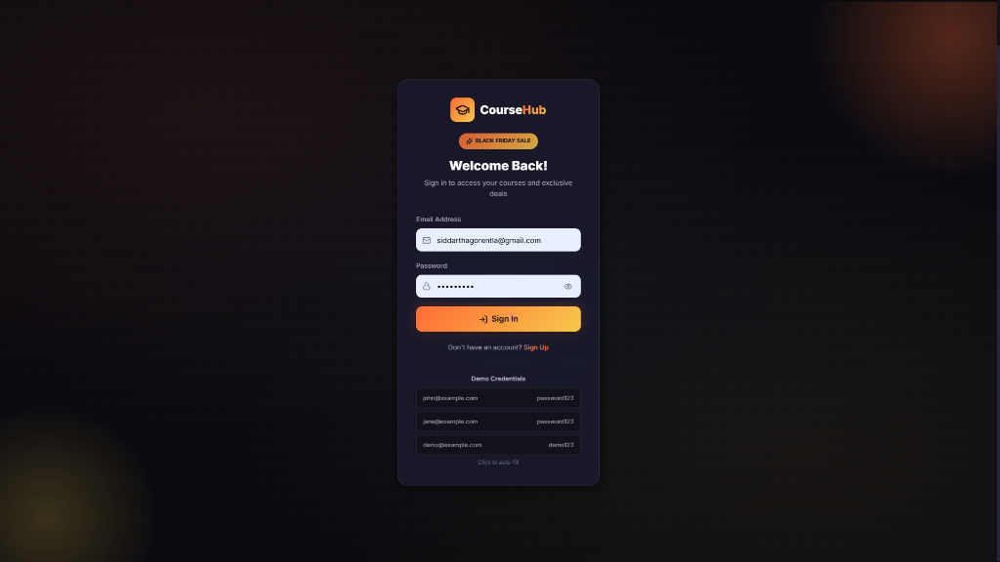
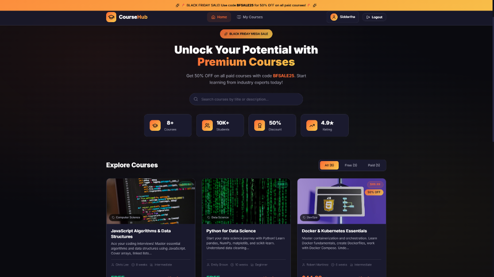
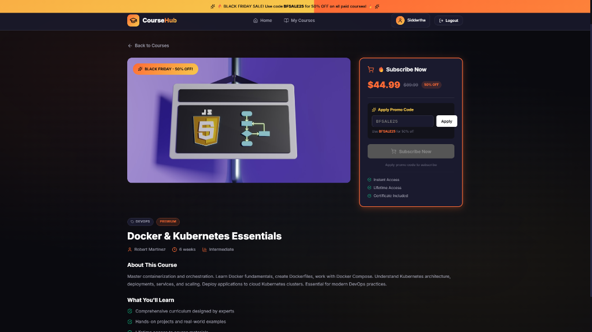
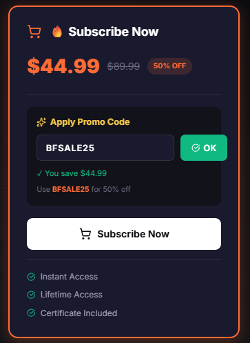
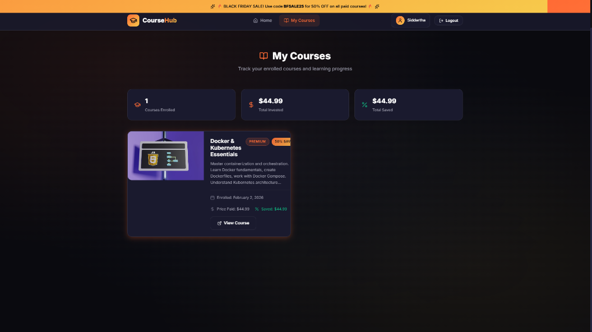

# 🎓 CourseHub - Mini Course Subscription Application (Black Friday Edition)

A full-stack web application where users can sign up, view courses, and subscribe based on whether a course is free or paid. Built with React, Node.js, Express, and MongoDB.


## 🌐 Live Demo

- **Frontend:** [https://cyberwarefare-siddartha.vercel.app](https://cyberwarefare-siddartha.vercel.app)
- **Backend API:** [https://cyberwarefare.onrender.com](https://cyberwarefare.onrender.com)

> ⚠️ **Note:** The backend is hosted on Render free tier. First request may take 30-60 seconds as the server spins up.

## 📸 Screenshots

### Login Page
Modern dark themed login with demo credentials for easy testing.



### Home Page
Browse all available courses with search and filter functionality. Each course card shows pricing with Black Friday discounts.



### Course Detail Page
View detailed course information with subscription options. Apply promo code for discounts on paid courses.



### Promo Code Validation
Apply `BFSALE25` for 50% off on all paid courses.



### My Courses Page
Track all your enrolled courses with subscription details including price paid and savings.



## 📋 Table of Contents

- [Features](#-features)
- [Demo Credentials](#-demo-credentials)
- [Tech Stack](#-tech-stack)
- [Project Structure](#-project-structure)
- [Prerequisites](#-prerequisites)
- [Local Development Setup](#-local-development-setup)
- [API Endpoints](#-api-endpoints)
- [Promo Code](#-promo-code)
- [Deployment](#-deployment)

## ✨ Features

### Authentication
- ✅ JWT-based authentication
- ✅ User signup & login
- ✅ Protected routes
- ✅ Persistent sessions using localStorage

### Courses
- ✅ Browse 8+ courses (mix of free and paid)
- ✅ Search courses by title/description
- ✅ Filter by course type (All/Free/Paid)
- ✅ Detailed course pages

### Subscription System
- ✅ Free course instant subscription
- ✅ Paid course promo code validation
- ✅ 50% Black Friday discount with code `BFSALE25`
- ✅ Subscription tracking
- ✅ Price savings display

### UI/UX
- ✅ Modern dark theme with Black Friday aesthetic
- ✅ Responsive design (mobile-first)
- ✅ Smooth animations and transitions
- ✅ Toast notifications
- ✅ Loading states and skeletons

## 🔐 Demo Credentials

Use any of these pre-created accounts to log in:

| Email | Password |
|-------|----------|
| `john@example.com` | `password123` |
| `jane@example.com` | `password123` |
| `demo@example.com` | `demo123` |

## 🛠 Tech Stack

### Frontend
- **React 18** - UI library
- **React Router v6** - Client-side routing
- **Axios** - HTTP client
- **React Hot Toast** - Toast notifications
- **Lucide React** - Icon library
- **Vite** - Build tool

### Backend
- **Node.js** - Runtime
- **Express** - Web framework
- **MongoDB** - Database (In-memory for development)
- **Mongoose** - ODM
- **JWT** - Authentication
- **bcryptjs** - Password hashing

## 📁 Project Structure

```
cyberwarefare/
├── client/                    # React Frontend
│   ├── public/
│   ├── src/
│   │   ├── components/        # Reusable components
│   │   │   ├── Header.jsx
│   │   │   ├── Header.css
│   │   │   ├── CourseCard.jsx
│   │   │   ├── CourseCard.css
│   │   │   └── ProtectedRoute.jsx
│   │   ├── context/           # React Context
│   │   │   └── AuthContext.jsx
│   │   ├── pages/             # Page components
│   │   │   ├── LoginPage.jsx
│   │   │   ├── SignupPage.jsx
│   │   │   ├── AuthPages.css
│   │   │   ├── HomePage.jsx
│   │   │   ├── HomePage.css
│   │   │   ├── CourseDetailPage.jsx
│   │   │   ├── CourseDetailPage.css
│   │   │   ├── MyCoursesPage.jsx
│   │   │   └── MyCoursesPage.css
│   │   ├── services/          # API services
│   │   │   └── api.js
│   │   ├── App.jsx
│   │   ├── App.css
│   │   ├── main.jsx
│   │   └── index.css
│   ├── index.html
│   ├── package.json
│   └── vite.config.js
│
├── server/                    # Node.js Backend
│   ├── config/
│   │   └── db.js              # MongoDB connection
│   ├── middleware/
│   │   └── auth.js            # JWT middleware
│   ├── models/
│   │   ├── User.js
│   │   ├── Course.js
│   │   └── Subscription.js
│   ├── routes/
│   │   ├── auth.js
│   │   ├── courses.js
│   │   └── subscriptions.js
│   ├── .env
│   ├── package.json
│   ├── seed.js                # Database seeder
│   └── server.js              # Entry point
│
├── screenshots/               # Application screenshots
│   ├── login-page.png
│   ├── home-page.png
│   ├── course-detail-page.png
│   ├── promo-code.png
│   └── my-courses-page.png
│
└── README.md
```

## 📦 Prerequisites

Before you begin, ensure you have the following installed:

- **Node.js** (v18 or higher) - [Download](https://nodejs.org/)
- **npm** (comes with Node.js)

> Note: MongoDB is handled in-memory for development, so no separate MongoDB installation is required!

## 🚀 Local Development Setup

### 1. Clone the Repository

```bash
git clone https://github.com/siddarthagorentla/cyberwarefare.git
cd cyberwarefare
```

### 2. Setup Backend

```bash
# Navigate to server directory
cd server

# Install dependencies
npm install

# Start the backend server (includes auto-seeding)
npm run dev
```

The backend will start at `http://localhost:5000`

### 3. Setup Frontend

```bash
# Open a new terminal
# Navigate to client directory
cd client

# Install dependencies
npm install

# Start the development server
npm run dev
```

The frontend will start at `http://localhost:5173`

### 4. Access the Application

Open your browser and navigate to `http://localhost:5173`

## 📡 API Endpoints

### Authentication

| Method | Endpoint | Description |
|--------|----------|-------------|
| POST | `/api/auth/signup` | Register a new user |
| POST | `/api/auth/login` | Login and get JWT token |
| GET | `/api/auth/me` | Get current user (protected) |

### Courses

| Method | Endpoint | Description |
|--------|----------|-------------|
| GET | `/api/courses` | Get all courses |
| GET | `/api/courses/:id` | Get single course |

### Subscriptions

| Method | Endpoint | Description |
|--------|----------|-------------|
| POST | `/api/subscribe` | Subscribe to a course (protected) |
| POST | `/api/subscribe/validate-promo` | Validate promo code (protected) |
| GET | `/api/subscribe/my-courses` | Get user's subscribed courses (protected) |
| GET | `/api/subscribe/check/:courseId` | Check subscription status (protected) |

## 🎟️ Promo Code

### Valid Promo Code: `BFSALE25`

- **Discount:** 50% off
- **Applies to:** All paid courses
- **Note:** Free courses don't require a promo code

### Subscription Logic

**For FREE Courses:**
1. Click "Subscribe for Free"
2. Instant subscription with no promo required

**For PAID Courses:**
1. Enter promo code `BFSALE25`
2. Click "Apply" to validate
3. See discounted price
4. Click "Subscribe Now"
5. Mock payment processed (no real payment)

## 🌐 Deployment

### Backend Deployment (Render/Railway/Heroku)

1. Push code to GitHub
2. Connect your repository to the hosting platform
3. Set environment variables:
   ```
   PORT=5000
   MONGODB_URI=<your-mongodb-atlas-uri>
   JWT_SECRET=<your-secure-secret>
   PROMO_CODE=BFSALE25
   PROMO_DISCOUNT=50
   ```
4. Deploy!

### Frontend Deployment (Vercel/Netlify)

1. Update `.env` with production API URL:
   ```
   VITE_API_URL=https://your-backend-url.com/api
   ```
2. Connect your repository
3. Set build command: `npm run build`
4. Set output directory: `dist`
5. Deploy!

### MongoDB Atlas (Free Tier)

1. Create account at [MongoDB Atlas](https://www.mongodb.com/atlas)
2. Create a free cluster
3. Get connection string
4. Update `MONGODB_URI` in backend `.env`

## 🧪 Testing the Application

1. **Signup/Login:** Create a new account or use demo credentials
2. **Browse Courses:** View all courses, use search and filters
3. **Subscribe to Free Course:** Click on any free course and subscribe
4. **Subscribe to Paid Course:** 
   - Click on a paid course
   - Enter promo code `BFSALE25`
   - Click Apply
   - Click Subscribe Now
5. **View My Courses:** Check your enrolled courses

## 📝 Database Schema

### Users Collection
```javascript
{
  _id: ObjectId,
  name: String,
  email: String (unique),
  password: String (hashed),
  createdAt: Date
}
```

### Courses Collection
```javascript
{
  _id: ObjectId,
  title: String,
  description: String,
  price: Number (0 = free),
  image: String,
  category: String,
  instructor: String,
  duration: String,
  level: String (Beginner/Intermediate/Advanced),
  createdAt: Date
}
```

### Subscriptions Collection
```javascript
{
  _id: ObjectId,
  userId: ObjectId (ref: User),
  courseId: ObjectId (ref: Course),
  pricePaid: Number,
  originalPrice: Number,
  promoCodeUsed: String,
  discountApplied: Number,
  subscribedAt: Date
}
```

## 🎨 Design Highlights

- **Dark Theme:** Premium dark UI with vibrant accent colors
- **Black Friday Theme:** Orange/Gold gradient accents
- **Glassmorphism:** Blur effects on cards
- **Micro-animations:** Smooth hover effects and transitions
- **Responsive:** Works on all device sizes

## 👨‍💻 Author

**Siddartha Gorentla**

## 📄 License

MIT License - feel free to use this project for learning or personal use.

---

Made with ❤️ for the Black Friday Course Sale!
